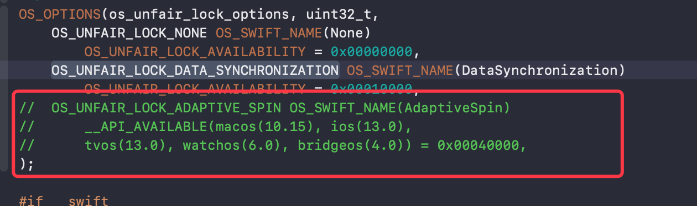
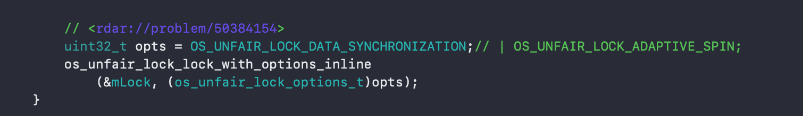

# Apple源码

### objc4-781

- OC部分开源代码

  参考博客：[iOS 底层原理03](https://blog.csdn.net/lin1109221208/article/details/108435967)、[OC底层原理二](https://www.jianshu.com/p/80c8d898469a)

  注意点: bridgeos为 Apple 针对 T 系列芯片（从 watchOS 引入特性）的内嵌式系统，与研究对象暂无关，

  需要注释掉如下两个部分：

  

  

